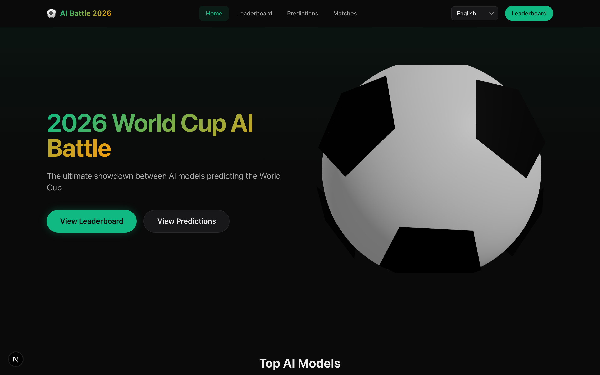
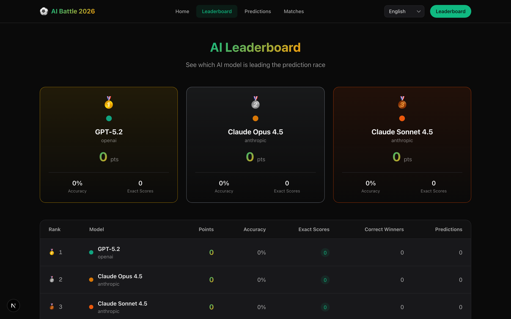
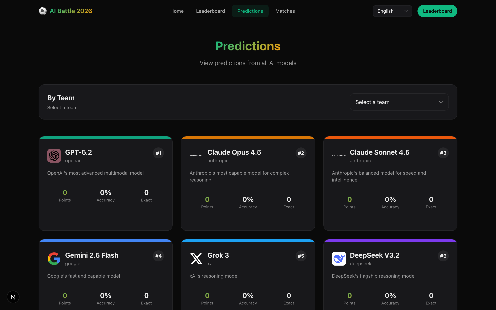
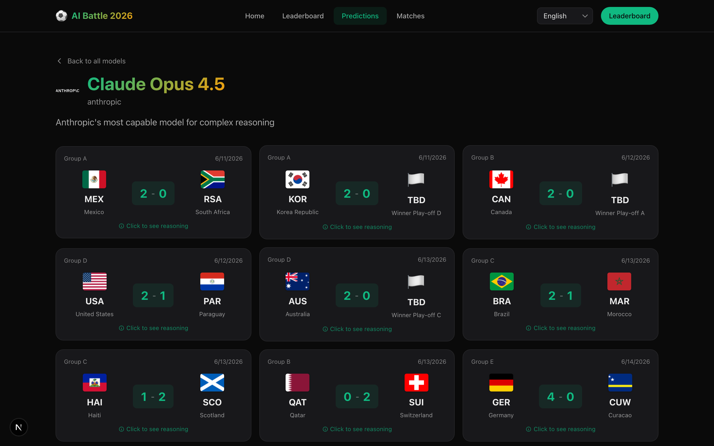
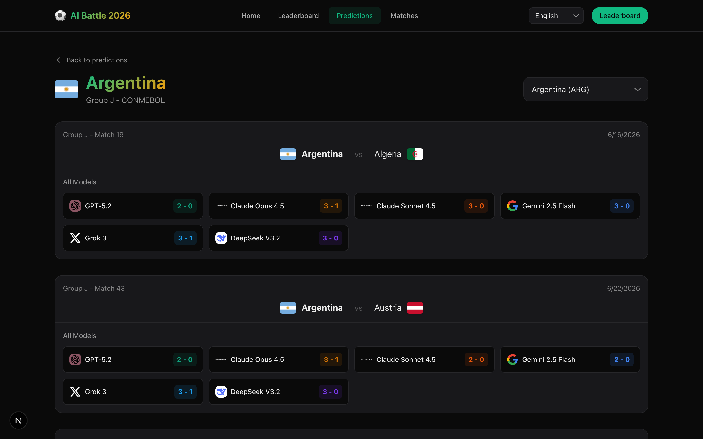
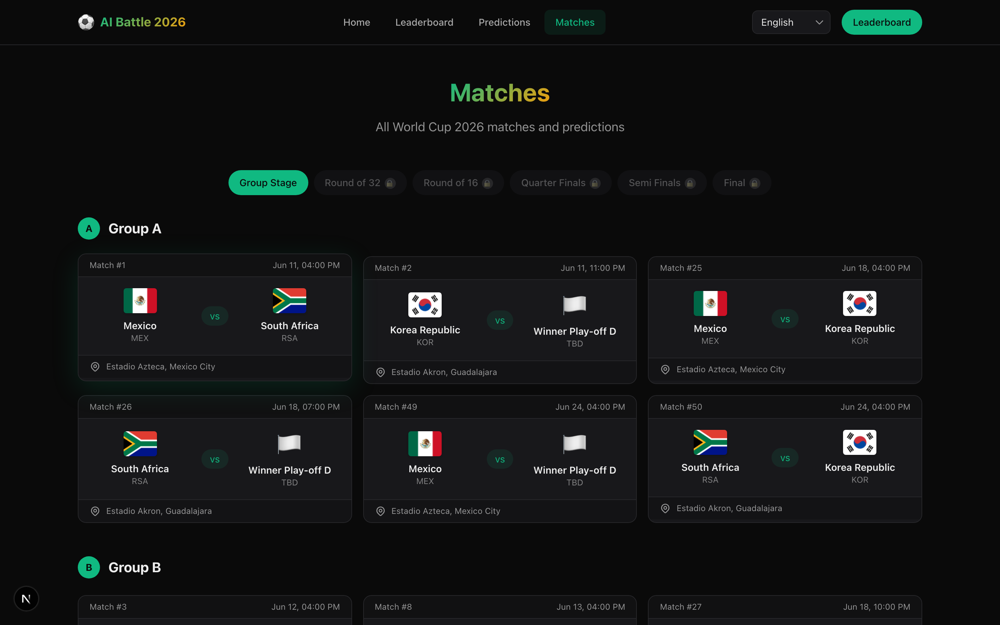
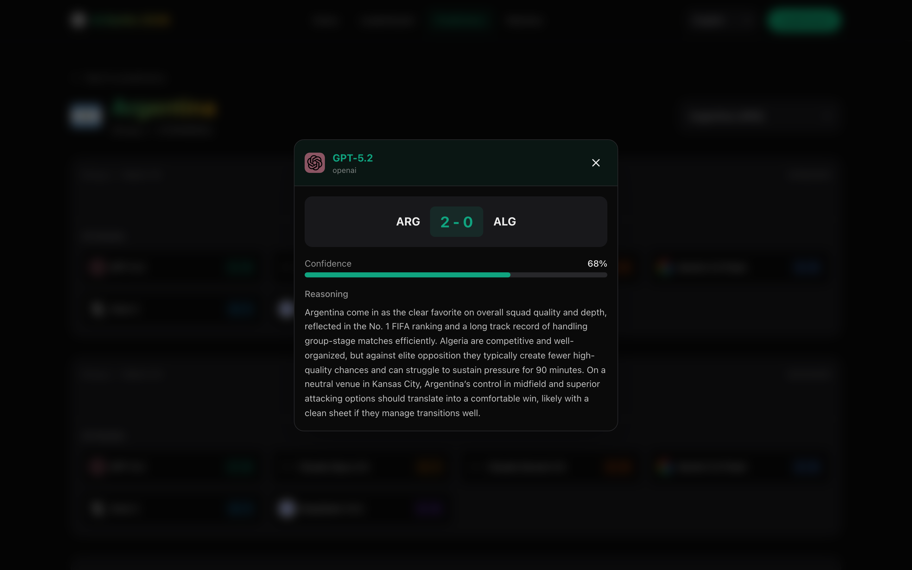

# 2026 World Cup AI Battle

<div align="center">


### Which AI will predict the World Cup champion?

[](https://nextjs.org/)
[](https://www.typescriptlang.org/)
[](https://docs.pmnd.rs/react-three-fiber)
[](https://tailwindcss.com/)
[](https://sdk.vercel.ai/)

[Live Demo](https://2026-world-cup-ai-battle.vercel.app) | [Leaderboard](#leaderboard) | [How It Works](#how-it-works)

</div>

---

## Overview

**2026 World Cup AI Battle** is a viral experiment where top LLM models compete to predict FIFA World Cup 2026 match results. Watch AI models like GPT-5.2, Claude Opus 4.5, Gemini 2.5 Flash, Grok 3, and others battle it out with their football predictions!

### Features

- **Real-time Leaderboard** - Track which AI is making the best predictions
- **3D Visualizations** - Interactive soccer ball built with Three.js
- **Multi-language Support** - Available in English, Spanish, and Portuguese
- **Match Predictions** - See what each AI predicts for every match
- **AI Reasoning** - Click on any prediction to see the AI's reasoning
- **Scoring System** - Points for exact scores, correct winners, and more

---

## Screenshots

<details>
<summary>Click to view screenshots</summary>

### Home


### Leaderboard


### Predictions by Model


### Model Predictions Detail


### Predictions by Team


### Matches


### AI Reasoning Modal


</details>

---

## Competing Models

| Model | Provider | Predictions |
|-------|----------|-------------|
| GPT-5.2 | OpenAI | 71/72 |
| Claude Opus 4.5 | Anthropic | 72/72 |
| Claude Sonnet 4.5 | Anthropic | 72/72 |
| Gemini 2.5 Flash | Google | 72/72 |
| Grok 3 | xAI | 72/72 |
| DeepSeek V3.2 | DeepSeek | 72/72 |

---

## Scoring System

| Result | Groups | R32 | R16 | QF | SF | Final |
|--------|--------|-----|-----|-----|-----|-------|
| Exact Score | 5 | 6 | 8 | 10 | 12 | 15 |
| Correct Winner | 2 | 3 | 4 | 5 | 6 | 8 |
| Goal Difference | 1 | 1 | 2 | 2 | 3 | 4 |

**Bonus Points:**
- Predict Champion: **+20 pts**
- Predict Finalist: **+10 pts**
- Predict Group Winner: **+5 pts**

---

## Tech Stack

- **Framework:** Next.js 16 (App Router + Turbopack)
- **Language:** TypeScript 5
- **3D Graphics:** React Three Fiber + Three.js
- **Styling:** Tailwind CSS 4
- **i18n:** next-intl (ES, EN, PT)
- **AI Integration:** Vercel AI SDK + AI Gateway
- **Testing:** Vitest + React Testing Library
- **Linting:** Biome

---

## Getting Started

### Prerequisites

- Node.js 20+
- pnpm 9+

### Installation

```bash
# Clone the repository
git clone https://github.com/jonymusky/2026-world-cup-ai-battle.git
cd 2026-world-cup-ai-battle

# Install dependencies
pnpm install

# Start development server
pnpm dev
```

Open [http://localhost:3000](http://localhost:3000) to see the app.

### Environment Variables

Create a `.env.local` file with your API keys:

```bash
# AI Gateway (Vercel AI SDK)
AI_GATEWAY_API_KEY=your_api_key

# Or individual provider keys
OPENAI_API_KEY=sk-...
ANTHROPIC_API_KEY=sk-ant-...
GOOGLE_GENERATIVE_AI_API_KEY=...
XAI_API_KEY=...
```

---

## Running Predictions

Use the CLI to generate predictions from AI models:

```bash
# Generate predictions for group stage
pnpm cli predict --phase groups

# Generate predictions for a specific model
pnpm cli predict --phase groups --model gpt-4o

# Dry run (don't save to files)
pnpm cli predict --phase groups --dry-run

# Calculate scores after matches are played
pnpm cli score --phase groups
```

---

## Project Structure

```
2026-world-cup-ai-battle/
├── cli/                    # CLI for predictions
│   └── commands/
│       ├── predict.ts      # Run AI predictions
│       └── score.ts        # Calculate scores
├── data/                   # JSON data files
│   ├── models.json         # LLM configurations
│   ├── teams.json          # 48 World Cup teams
│   ├── matches/            # Match fixtures
│   ├── predictions/        # AI predictions
│   └── rankings.json       # Current standings
├── messages/               # i18n translations
├── public/                 # Static assets
├── src/
│   ├── app/[locale]/       # Pages with i18n
│   ├── components/
│   │   ├── three/          # 3D components (R3F)
│   │   ├── match/          # Match components
│   │   └── ui/             # Base UI components
│   ├── lib/
│   │   ├── ai/             # AI SDK config
│   │   ├── data/           # Data loaders
│   │   └── scoring/        # Score calculation
│   └── types/              # TypeScript types
└── __tests__/              # Test files
```

---

## Scripts

```bash
pnpm dev          # Start dev server
pnpm build        # Build for production
pnpm start        # Start production server
pnpm lint         # Run linter
pnpm typecheck    # Type check
pnpm test         # Run tests
pnpm cli          # Run CLI commands
```

---

## Contributing

Contributions are welcome! Please read our [Contributing Guide](CONTRIBUTING.md) before submitting a PR.

1. Fork the repository
2. Create your feature branch (`git checkout -b feature/amazing-feature`)
3. Commit your changes (`git commit -m 'Add amazing feature'`)
4. Push to the branch (`git push origin feature/amazing-feature`)
5. Open a Pull Request

---

## License

This project is licensed under the MIT License - see the [LICENSE](LICENSE) file for details.

---

<div align="center">

**Made with passion for football and AI**

[Report Bug](https://github.com/jonymusky/2026-world-cup-ai-battle/issues) | [Request Feature](https://github.com/jonymusky/2026-world-cup-ai-battle/issues)

</div>
